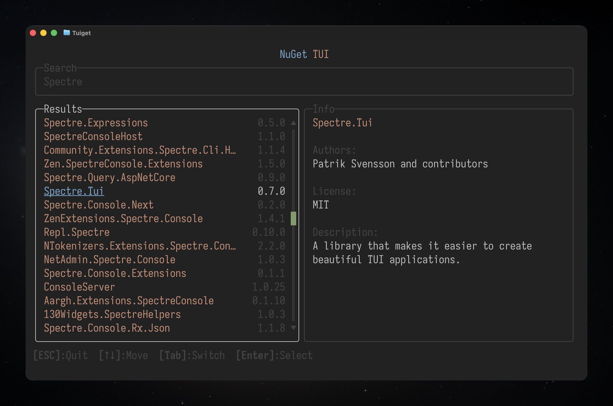

# TUIget

An experiment to build a NuGet explorer with a terminal user interface.  
Inspired by [@phil-scott-78](https://github.com/phil-scott-78)'s 
[Spectre.Tui.Doodads](https://github.com/phil-scott-78/Spectre.Tui.Doodads) library.



> [!NOTE]  
> This project is just a sandbox for the Spectre.Tui library, and is not 
> to be considered a serious project.

## Building

```shell
$ dotnet build.cs
```

## Copyright

Copyright Patrik Svensson